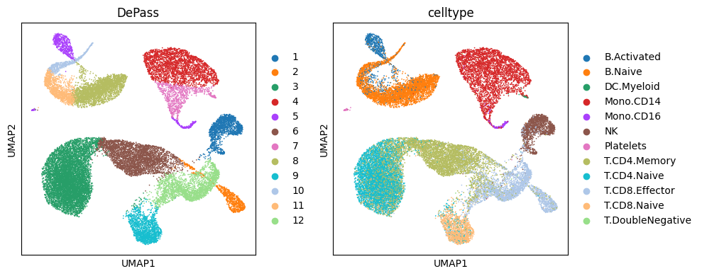

# Tutorial 13: TEA-seq (PBMC)

TEA-seq enables simultaneous analysis of chromatin accessibility, gene expression, and surface proteins within individual cells. DePass was applied to the human PBMC TEA-seq dataset (25,517 cells) for cross-modal integration. This tutorial demonstrates clustering and dimensionality reduction (UMAP) visualization. 

### Preparation


```python
import scanpy as sc
import torch
import random
import pandas as pd
import numpy as np
import os
import warnings
warnings.filterwarnings("ignore")

import sys
# sys.path.append('/home/jyx/DePass/')

from DePass.utils import *
fix_seed(2024)  

# Environment configuration
device = torch.device('cuda:0' if torch.cuda.is_available() else 'cpu')

os.environ['R_HOME'] = '/home/jyx/anaconda3/envs/DePass/lib/R'

path = '../data/dataset_TEAseq'
os.mkdir(path) if not os.path.exists(path) else print(f"The directory '{path}' already exists.\n")
```

### Loading and Preprocessing


```python
adata_omics1 = sc.read_h5ad('../data/dataset_TEAseq/adata_RNA.h5ad')
adata_omics2 = sc.read_h5ad('../data/dataset_TEAseq/adata_ATAC.h5ad')
adata_omics3 = sc.read_h5ad('../data/dataset_TEAseq/adata_ADT.h5ad')

preprocess_data(adata=adata_omics1,modality='rna')
preprocess_data(adata=adata_omics2,modality='atac')
preprocess_data(adata=adata_omics3,modality='protein')

adata_omics1.obsm['input_feat'] = adata_omics1.obsm['X_norm'].copy()
adata_omics2.obsm['input_feat'] = adata_omics2.obsm['X_lsi'].copy()
adata_omics3.obsm['input_feat'] = adata_omics3.obsm['X_clr'].copy()
data = {'rna': adata_omics1, 'atac': adata_omics2,'protein': adata_omics3}
```

### Training the model


```python
from DePass.model import DePass
model = DePass(data, data_type='single_cell',device=device)
output = model.train()
```

    [Config]
    Modalities: 3 | Data: single_cell | Device: NVIDIA GeForce RTX 4090 
    
    [Initializing]
    Graph Construction : Running...
    Graph Construction : Done!
    Data Enhancement : Running...
    Data Enhancement : Done!
    
    [Training]
    Model training starts...


    100%|██████████| 200/200 [01:18<00:00,  2.54it/s]


    Model training finished!
    


```python
adata = adata_omics1.copy()
adata.obsm['DePass'] = model.embedding
```

### Clustering


```python
from DePass.utils import *
clustering(adata=adata,n_clusters=12,key='DePass',add_key='DePass',method='mclust',use_pca=True)
```

    R[write to console]:                    __           __ 
       ____ ___  _____/ /_  _______/ /_
      / __ `__ \/ ___/ / / / / ___/ __/
     / / / / / / /__/ / /_/ (__  ) /_  
    /_/ /_/ /_/\___/_/\__,_/____/\__/   version 6.1.1
    Type 'citation("mclust")' for citing this R package in publications.
    


    fitting ...
      |======================================================================| 100%


```python
from DePass.utils import super_eval
import pandas as pd
re = super_eval(adata.obs['DePass'],adata.obs['Y'])
pd.DataFrame(list(re.items()), columns=['metric', 'Value']).to_csv(path + '/re.csv', sep='\t', index=True, float_format='%.6f')
print(re)
```

    {'AMI': 0.7104595717830307, 'NMI': 0.7107990601869504, 'ARI': 0.5768430368457738, 'Homogeneity': 0.7509261272157207, 'V-measure': 0.7107990601869502, 'Mutual Information': 1.4790815564191038}


```python
import scanpy as sc
import matplotlib.pyplot as plt

sc.pp.neighbors(adata, use_rep='DePass', n_neighbors=30)
sc.tl.umap(adata)

fig, axs = plt.subplots(1, 2, figsize=(10, 4))  
sc.pl.umap(
    adata, 
    color='DePass', 
    title='DePass', 
    ax=axs[0],   
    s=6, 
    show=False
)
sc.pl.umap(
    adata, 
    color='celltype', 
    title='celltype', 
    ax=axs[1],   
    s=6, 
    show=False
)
plt.tight_layout()
plt.savefig(path + '/DePass.png', bbox_inches='tight', dpi=300)
plt.show()

```


    

    


    <Figure size 640x480 with 0 Axes>

