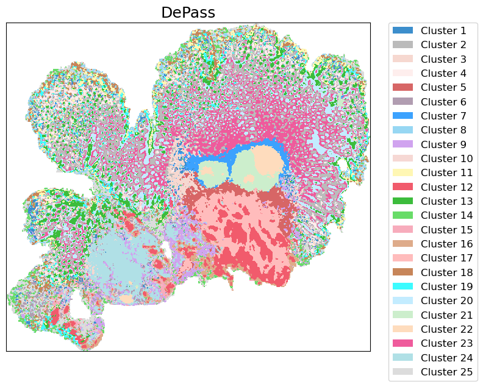

# Tutorial 7: Spatial Stereo-CITE-seq (CRC)

This tutorial demonstrates cross-modal integration of the human colorectal cancer (CRC) spatial Stereo CITE-seq dataset (446,095 bins) using DePass, and identification of spatial domains within colon cancer tissues. The DePass employs a subgraph-based learning strategy, which enables efficient large-scale data processing by subgraph sampling without compromising data resolution.


### Preparation


```python
import scanpy as sc
import torch
import random
import pandas as pd
import numpy as np
import os
import warnings
warnings.filterwarnings("ignore")

import sys
# sys.path.append('/home/jyx/DePass/')

from DePass.utils import *
fix_seed(2024)  

# Environment configuration
device = torch.device('cuda:0' if torch.cuda.is_available() else 'cpu')

os.environ['R_HOME'] = '/home/jyx/anaconda3/envs/DePass/lib/R'

path = '../data/dataset_CRC_bin20'
os.mkdir(path) if not os.path.exists(path) else print(f"The directory '{path}' already exists.\n")
```

    The directory '../data/dataset_CRC_bin20' already exists.
    


### Loading and Preprocessing


```python
adata_omics1 = sc.read_h5ad('../data/dataset_CRC_bin20/adata_RNA_006_bin20.h5ad')
adata_omics2 = sc.read_h5ad('../data/dataset_CRC_bin20/adata_ADT_006_bin20.h5ad')

preprocess_data(adata=adata_omics1,modality='rna')
preprocess_data(adata=adata_omics2,modality='protein')

adata_omics1.obsm['input_feat'] = adata_omics1.obsm['X_norm'].copy()
adata_omics2.obsm['input_feat'] = adata_omics2.obsm['X_clr'].copy()
data = {'rna': adata_omics1, 'protein': adata_omics2}
```

### Training the model


```python
from DePass.model import DePass
model = DePass(data, data_type='spatial', sub_graph_size=6e4,K_spatial=10,K_feature=30, device=device)
model.train()
```

    [Config]
    Modalities: 2 | Data: spatial | Device: NVIDIA GeForce RTX 4090 
    
    [Initializing]
    Graph Construction : Running...
    Graph Construction : Done!
    Data Enhancement : Running...
    Data Enhancement : Done!


    Computing METIS partitioning...
    Done!


    
    [Training]
    Model training starts...


    100%|██████████| 200/200 [2:14:59<00:00, 40.50s/it]  


    Model training finished!
    


```python
adata = adata_omics1.copy()
adata.obsm['DePass'] = model.embedding
adata.obsm['alpha'] = model.alpha 
adata.obsm['x1_enh'] = model.x1_enh
adata.obsm['x2_enh'] = model.x2_enh
```

### Detect spatial domain 


```python

from DePass.utils import *
clustering(adata=adata,n_clusters=25,key='DePass',add_key='DePass25',method='mclust', use_pca=True)

from DePass.analyze_utils import plot_superpixel

plot_superpixel(
    adata=adata,
    label_key='DePass25',
    save_path=path,
    save_name='DePass25',
    title="DePass",
    figscale=100,
    show=True
)
```

    Image saved to: ../data/dataset_CRC_bin20/DePass25.png


    

    

