# Tutorial 1: Spatial CITE-seq (Human Tonsil)

DePass was applied to the human tonsil spatial CITE-seq dataset (2,492 spatial spots) for cross-modal integration and data enhancement. This tutorial demonstrates: 

1. Spatial domain identification in tonsil tissue using DePass.
2. Validation of data enhancement through comparative analysis of biomarker log2 fold-changes (LogFC) and spatial expression patterns.
3. In addition, random masked data and random noisy data were constructed for DePass integration, demonstrating DePass's ability to recover biologically meaningful signals. 


### Preparation


```python
import scanpy as sc
import torch
import random
import pandas as pd
import numpy as np
import os
import warnings

warnings.filterwarnings("ignore")
from DePass.utils import *

fix_seed(2024)  

# Environment configuration
device = torch.device('cuda:0' if torch.cuda.is_available() else 'cpu')

os.environ['R_HOME'] = '/home/jyx/anaconda3/envs/DePass/lib/R'
   
path = '../data/dataset_HumanTonsil'
os.mkdir(path) if not os.path.exists(path) else print(f"The directory '{path}' already exists.\n")
```

### Loading and preprocessing

Load the raw count data and perform preprocessing to ensure high-quality input for model. The preprocessing methods are detailed below:
For transcriptomics, we filtered gene features to retain those detected in ≥1% of cells. Top 1,000 highly variable genes (HVGs) were selected via Seurat v3 dispersion-based method. Counts were normalized per cell (total scaling to 10^4), followed by log1p transformation and z-score standardization via scanpy package. For proteomics, protein expression matrices were normalized using centered log-ratio (CLR) transformation to address compositionality biases, followed by feature-wise z-score standardization.


```python
adata_omics1 = sc.read_h5ad('../data/dataset_HumanTonsil/adata_RNA.h5ad')
adata_omics2 = sc.read_h5ad('../data/dataset_HumanTonsil/adata_ADT.h5ad')

preprocess_data(adata=adata_omics1,modality='rna')
preprocess_data(adata=adata_omics2,modality='protein')

adata_omics1.obsm['input_feat'] = adata_omics1.obsm['X_norm'].copy()
adata_omics2.obsm['input_feat'] = adata_omics2.obsm['X_clr'].copy()
data = {'rna': adata_omics1, 'protein': adata_omics2}

```

### Training the model

The DePass model is designed for multi-omics data integration at both spatial and single-cell data. After training, the output file includes the following key results:

1. **`embedding`**: Integrated embedding representation, which integrates multi-omics expression features with spatial coordinate information (for spatial data). This representation is used directly for downstream tasks (e.g., spatial domain segmentation) or visualization (e.g., UMAP). 
2. **`x1_enh`**: Enhanced feature matrix for the first omics modality.  
3. **`x2_enh`**: Enhanced feature matrix for the second omics modality.  
4. **`alpha`**: Cross-modality attention weight matrix, dynamically learned through a attention mechanism. It reflects the relative importance of each modality in clustering units (e.g., cells/spots/bins).


```python
from DePass.model import DePass
# data (dict): Input data dictionary containing multiple modality data. 
# data_type (str, optional): Data type, which can be 'spatial' or 'single_cell'.  
# epochs (int, optional): Total number of training epochs. Defaults to 200. 
# batch_training (bool, optional): Whether to use batch training. Defaults to False. 
model = DePass(data, data_type='spatial',device=device)
output = model.train()
```

    [Config]
    Modalities: 2 | Data: spatial | Device: NVIDIA GeForce RTX 4090 
    
    [Initializing]
    Graph Construction : Running...
    Graph Construction : Done!
    Data Enhancement : Running...
    Data Enhancement : Done!
    
    [Training]
    Model training starts...


    100%|██████████| 200/200 [00:02<00:00, 70.81it/s]

    Model training finished!
    


    


```python
adata = adata_omics1.copy()
adata.obsm['DePass'] = model.embedding
adata.obsm['alpha'] = model.alpha 
adata.obsm['x1_enh'] = model.x1_enh
adata.obsm['x2_enh'] = model.x2_enh
```

### Detect spatial domain 

After the model is trained, we use the integrated representation for cluster analysis. Here we provide three optional clustering tools, including **mclust**, **leiden**, and **kmeans**. We recommend using the **mclust** algorithm for clustering and specifying the number of target clusters. In this example, we set the number of clusters to 7 and use PCA for dimensionality reduction by setting `use_pca=True`.  The clustering results are stored in the `adata` object under the key `'DePass'`. 

We perform **spatial visualization of regions** using **matplotlib**, where colors correspond to the cluster assignments. 


```python
from DePass.utils import *
clustering(adata=adata,n_clusters=7,key='DePass',add_key='DePass',method='mclust',use_pca=True)

```

    R[write to console]:                    __           __ 
       ____ ___  _____/ /_  _______/ /_
      / __ `__ \/ ___/ / / / / ___/ __/
     / / / / / / /__/ / /_/ (__  ) /_  
    /_/ /_/ /_/\___/_/\__,_/____/\__/   version 6.1.1
    Type 'citation("mclust")' for citing this R package in publications.
    


    fitting ...
      |======================================================================| 100%


```python
from DePass.analyze_utils import plot_spatial

plot_spatial(
    adata,
    color='DePass',
    save_path=path,
    save_name='DePass',
    title="DePass",
    s=40,
    dpi=300,
    format='pdf',
    frameon =True,
    colorbar_loc='right', 
    show=True,
)

```


    

    


```python
adata.write(path+'/adata.h5ad')
```

### Visualization of the attention weights
The attention mechanism dynamically learns weights across all modalities for each individual cell (spots/bins). These weights reveal relative importance of different modalities (transcriptomics, proteomics). High proteomics weights within a cluster indicate that proteomic data significantly drives the molecular characterization of that cluster.


```python
from DePass.analyze_utils import plot_modality_weights
palette = {"RNA": "#9F0000", "Protein": "#003A75"}
plot_modality_weights(
    adata,
    save_path=path,
    save_name="rna_protein_weights",
    figsize=(5, 3),
)
```


    
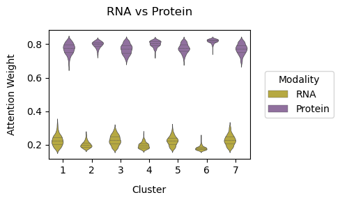
    


    <Axes: title={'center': 'RNA vs Protein'}, xlabel='Cluster', ylabel='Attention Weight'>


### Data enhancement analysis


Perform differential expression analysis using **scanpy**. Set the grouping variable to 'DePass'. Rank genes with the 'wilcoxon' method to calculate log-fold change (logFC) values. 


```python
adata1_high = adata_omics1[:,adata_omics1.var['highly_variable']]
# adata1_high.write(path+'/adata1_high.h5ad')
# adata_omics2.write(path+'/adata_omics2.h5ad')
```


```python
import anndata as ad
# Create two AnnData objects to store the raw and enhanced data. 
adata2_R = ad.AnnData(X=adata_omics2.obsm['X_clr'], obs=adata.obs[['DePass']].copy(), var=adata_omics2.var.copy(), obsm={'spatial': adata_omics2.obsm['spatial'].copy()})
adata2_E = ad.AnnData(X=adata.obsm['x2_enh'], obs=adata.obs[['DePass']].copy(), var=adata_omics2.var.copy(), obsm={'spatial': adata_omics2.obsm['spatial'].copy()})

```


```python
# adata2_R = sc.read(path+'/adata2_R.h5ad')
# adata2_E = sc.read(path+'/adata2_E.h5ad')
```


```python
from DePass.analyze_utils import rank_genes_groups
rank_genes_groups(adata=adata2_R, save_path=path, groupby='DePass', figname='rank_x2_R', method='wilcoxon', n_genes=10,show=True)
rank_genes_groups(adata=adata2_E, save_path=path, groupby='DePass', figname='rank_x2_E', method='wilcoxon', n_genes=10,show=False)
```


    
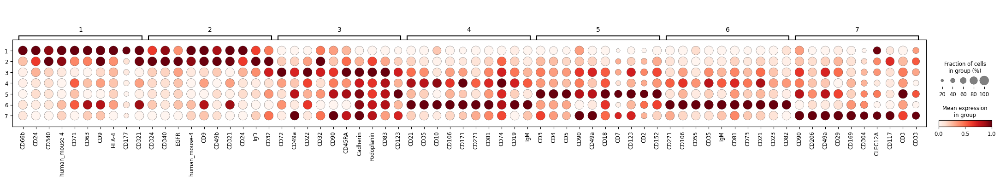
    


```python
adata2_R.write(path+'/adata2_R.h5ad')
adata2_E.write(path+'/adata2_E.h5ad')
```


### Comparison of spatial expression patterns and logFC for markers

```python
from DePass.analyze_utils import plot_marker_comparison_with_logFC

# The user needs to specify the clustering corresponding to each marker. 
# For example, if you are analyzing the gene CD23 in group 6, you would set target_gene = 'CD23' and target_group = '6'.
plot_marker_comparison_with_logFC(adata2_R, adata2_E, target_gene='CD23', target_group='6', save_path=path, save_name='CD23', s=40, dpi=300, show=True)
```


    
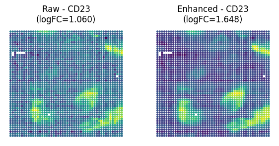
    


```python
from DePass.analyze_utils import *
plot_marker_comparison_with_logFC(adata2_R, adata2_E, target_gene='IgM', target_group='6', save_path=path, save_name='IgM', s=40, dpi=300, show=True)
```


    
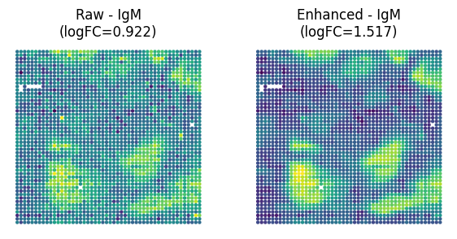
    


### DePass for noisy data


To evaluate the robustness of DePass to data disturbances and the ability of its data enhancement mechanism to repair disturbed data, we introduced controlled Gaussian noise into both RNA and protein patterns. Specifically, DePass generates integrated representations and enhancement features from perturbed inputs. 

The details of noise data generation are as follows: For each input mode, Gaussian noise with a mean of 0 and a standard deviation of 1.5 (a predefined noise level) is added to the preprocessed data prior to model input.


```python
noise_level =1.5

from DePass.analyze_utils import noise
noisy_data1, noisy_data2 = noise(adata_omics1,adata_omics2,noise_level)

adata_omics1.obsm['input_feat'] = noisy_data1
adata_omics2.obsm['input_feat'] = noisy_data2
data = {'rna': adata_omics1, 'protein': adata_omics2}
```


```python
model_N = DePass(data, data_type='spatial',device=device)  
model_N.train()

adata.obsm['DePass_noise'] = model_N.embedding
adata.obsm['x2_enh_noise'] = model_N.x2_enh

import anndata as ad
# Create two AnnData objects to store the noisy and enhanced noisy data. 
adata2_R_noise = ad.AnnData(X=noisy_data2, obs=adata.obs[['DePass']].copy(), var=adata_omics2.var.copy(), obsm={'spatial': adata_omics2.obsm['spatial'].copy()})
adata2_E_noise = ad.AnnData(X=adata.obsm['x2_enh_noise'], obs=adata.obs[['DePass']].copy(), var=adata_omics2.var.copy(), obsm={'spatial': adata_omics2.obsm['spatial'].copy()})
```

    [Config]
    Modalities: 2 | Data: spatial | Device: NVIDIA GeForce RTX 4090 
    
    [Initializing]
    Graph Construction : Running...
    Graph Construction : Done!
    Data Enhancement : Running...
    Data Enhancement : Done!
    
    [Training]
    Model training starts...


    100%|██████████| 200/200 [00:01<00:00, 104.04it/s]

    Model training finished!
    


    


### DePass for maskded data 

Random masking was implemented through modality-specific protocols: For transcriptomic data, non-zero entries were randomly masked (mask ratio: 0.16, a predefined ratio) following HVG selection. Proteomic features were masked prior to CLR normalization. 

```python
from DePass.analyze_utils import Generate_masked_data


adata1_raw=sc.read_h5ad('../data/dataset_HumanTonsil/adata_RNA.h5ad')
adata2_raw=sc.read_h5ad('../data/dataset_HumanTonsil/adata_ADT.h5ad')
masked_data1, masked_data2 = Generate_masked_data(adata1_raw,adata2_raw,mask_ratio=0.16)

adata_omics1.obsm['input_feat'] = masked_data1
adata_omics2.obsm['input_feat'] = masked_data2
data = {'rna': adata_omics1, 'protein': adata_omics2}
```


```python
model_M = DePass(data, data_type='spatial',device=device)  
model_M.train()

adata.obsm['DePass_mask'] = model_M.embedding
adata.obsm['x2_enh_mask'] = model_M.x2_enh

import anndata as ad
# Create two AnnData objects to store the masked and enhanced masked data. 
adata2_R_mask = ad.AnnData(X=masked_data2, obs=adata.obs[['DePass']].copy(), var=adata_omics2.var.copy(), obsm={'spatial': adata_omics2.obsm['spatial'].copy()})
adata2_E_mask = ad.AnnData(X=adata.obsm['x2_enh_mask'], obs=adata.obs[['DePass']].copy(), var=adata_omics2.var.copy(), obsm={'spatial': adata_omics2.obsm['spatial'].copy()})
```

    [Config]
    Modalities: 2 | Data: spatial | Device: NVIDIA GeForce RTX 4090 
    
    [Initializing]
    Graph Construction : Running...
    Graph Construction : Done!
    Data Enhancement : Running...
    Data Enhancement : Done!
    
    [Training]
    Model training starts...


    100%|██████████| 200/200 [00:01<00:00, 100.22it/s]

    Model training finished!
    


    


### Data enhancement analysis: clustering


```python
from DePass.utils import *
clustering(adata=adata2_R_noise,n_clusters=7,use_X=True,add_key='noise',method='mclust',use_pca=True)

from DePass.analyze_utils import *
plot_spatial(
    adata2_R_noise,
    color='noise',
    save_path=path,
    title="Noise",
    save_name="Noise",
    s=40,
    dpi=300,
    frameon=True,
    format='pdf',
    show=True,
)
```


    
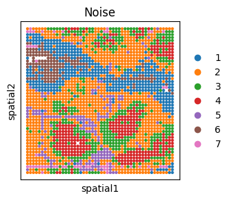
    


```python
from DePass.utils import *
clustering(adata=adata2_R_mask,n_clusters=7,use_X=True,add_key='mask',method='mclust',use_pca=True)


plot_spatial(
    adata2_R_mask,
    color='mask',
    save_path=path,
    title="Mask",
    save_name="Mask",
    s=40,
    dpi=300,
    frameon=True,
    format='pdf',
    show=True,
)
```


    
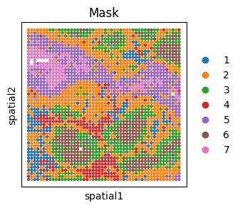
    


```python
from DePass.utils import *
clustering(adata=adata2_E_noise,n_clusters=7,use_X=True,add_key='noise enh',method='mclust',use_pca=True)


plot_spatial(
    adata2_E_noise,
    color='noise enh',
    save_path=path,
    title="Noise Enh",
    save_name="Noise Enh",
    s=40,
    dpi=300,
    frameon=True,
    format='pdf',
    show=True
)

```


    
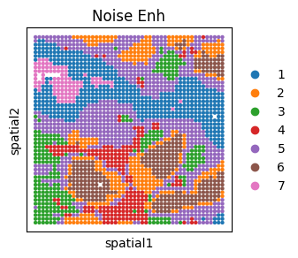
    


```python
from DePass.utils import *
clustering(adata=adata2_E_mask,n_clusters=7,use_X=True,add_key='mask enh',method='mclust',use_pca=True)


plot_spatial(
    adata2_E_mask,
    color='mask enh',
    save_path=path,
    title="Mask Enh",
    save_name='Mask Enh',
    s=40,
    dpi=300,
    frameon=True,
    format='pdf',
    show=True,
)

```


    
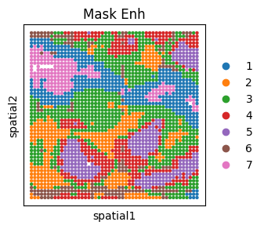
    


```python
adata2_R_noise.write(path+'/adata2_R_noise.h5ad')
adata2_E_noise.write(path+'/adata2_E_noise.h5ad')
adata2_R_mask.write(path+'/adata2_R_mask.h5ad')
adata2_E_mask.write(path+'/adata2_E_mask.h5ad')
```


```python
adata2_R_noise = sc.read(path+'/adata2_R_noise.h5ad')
adata2_E_noise = sc.read(path+'/adata2_E_noise.h5ad')
adata2_R_mask = sc.read(path+'/adata2_R_mask.h5ad')
adata2_E_mask = sc.read(path+'/adata2_E_mask.h5ad')
```

### Data enhancement analysis: marker LogFC and expression pattern

Perform differential expression analysis using **scanpy**. Set the grouping variable to 'DePass'. Rank genes with the 'wilcoxon' method to calculate log-fold change (logFC) values. 


```python
from DePass.analyze_utils import rank_genes_groups
rank_genes_groups(adata=adata2_R_noise, groupby='DePass', method='wilcoxon', n_genes=10,show=False)
rank_genes_groups(adata=adata2_E_noise, groupby='DePass', method='wilcoxon', n_genes=10,show=False)
rank_genes_groups(adata=adata2_R_mask , groupby='DePass', method='wilcoxon', n_genes=10,show=False)
rank_genes_groups(adata=adata2_E_mask , groupby='DePass', method='wilcoxon', n_genes=10,show=False)
```


```python
# The user needs to specify the clustering corresponding to each marker. 
# For example, if you are analyzing the gene CD23 in group 6, you would set target_gene = 'CD23' and target_group = '6'.
plot_marker_comparison_with_logFC(adata2_R_noise, adata2_E_noise, target_gene='CD23', target_group='6', save_path=path, save_name='CD23', s=40, dpi=300, show=True)
```


    
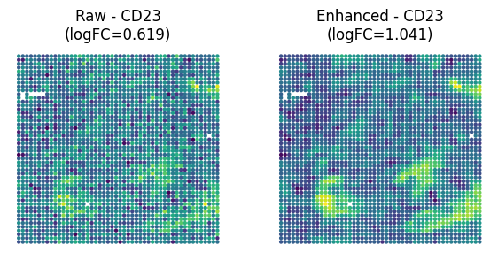
    


```python
from DePass.analyze_utils import plot_marker_comparison_with_logFC

plot_marker_comparison_with_logFC(adata2_R_noise, adata2_E_noise, target_gene='IgM', target_group='6', save_path=path, save_name='IgM', s=40, dpi=300, show=True)
```


    
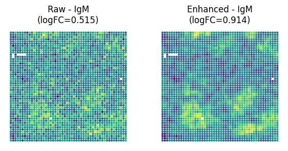
    


```python
# The user needs to specify the clustering corresponding to each marker. 
# For example, if you are analyzing the gene CD23 in group 6, you would set target_gene = 'CD23' and target_group = '6'.
plot_marker_comparison_with_logFC(adata2_R_mask, adata2_E_mask, target_gene='CD23', target_group='6', save_path=path, save_name='CD23', s=40, dpi=300, show=True)

```


    
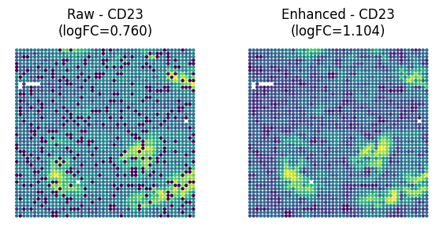
    


```python
from DePass.analyze_utils import plot_marker_comparison_with_logFC
plot_marker_comparison_with_logFC(adata2_R_mask, adata2_E_mask, target_gene='IgM', target_group='6', save_path=path, save_name='IgM', s=40, dpi=300, show=True)
```


    
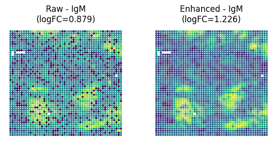
    


## logFC comparison


```python

MASK = "M"
MASK_ENH = "M+"
NOISE = "N"
NOISE_ENH = "N+" 
RAW = "R"
RAW_ENH = "R+"

name=[MASK, MASK_ENH,NOISE, NOISE_ENH, RAW, RAW_ENH]


target_genes = ['CD23', 'IgM','CD21','CD171','CD35','CD3', 'CD4','CD5'] 
target_groups = ['6']*5 +  ['5']*3  # The user needs to specify the clustering corresponding to each marker. 

from DePass.analyze_utils import get_logfc_df
long_df = get_logfc_df(
    adata_list=[adata2_R_mask, adata2_E_mask,adata2_R_noise, adata2_E_noise, adata2_R, adata2_E],
    adata_names=name,
    target_genes=target_genes,
    target_groups=target_groups,
    save_path=path,
    save_name="marker_logfc_comparison"
)

# print(long_df)
```

         Gene Group type     logFC
    0    CD23     6    M  0.759838
    1     IgM     6    M  0.878637
    2    CD21     6    M  0.490633
    3   CD171     6    M  0.907568
    4    CD35     6    M  0.641030
    5     CD3     5    M  0.772915
    6     CD4     5    M  0.741289
    7     CD5     5    M  0.842632
    8    CD23     6   M+  1.103906
    9     IgM     6   M+  1.225543
    10   CD21     6   M+  0.689494
    11  CD171     6   M+  1.035864
    12   CD35     6   M+  0.894980
    13    CD3     5   M+  0.875363
    14    CD4     5   M+  0.821094
    15    CD5     5   M+  0.904210
    16   CD23     6    N  0.618903
    17    IgM     6    N  0.514847
    18   CD21     6    N  0.494527
    19  CD171     6    N  0.337942
    20   CD35     6    N  0.476990
    21    CD3     5    N  0.463359
    22    CD4     5    N  0.311420
    23    CD5     5    N  0.299364
    24   CD23     6   N+  1.041034
    25    IgM     6   N+  0.913508
    26   CD21     6   N+  0.913057
    27  CD171     6   N+  0.709791
    28   CD35     6   N+  0.890313
    29    CD3     5   N+  0.761227
    30    CD4     5   N+  0.559068
    31    CD5     5   N+  0.628539
    32   CD23     6    R  1.060397
    33    IgM     6    R  0.922499
    34   CD21     6    R  0.887329
    35  CD171     6    R  0.968875
    36   CD35     6    R  1.001511
    37    CD3     5    R  0.888821
    38    CD4     5    R  0.833654
    39    CD5     5    R  0.896358
    40   CD23     6   R+  1.648385
    41    IgM     6   R+  1.516659
    42   CD21     6   R+  1.325922
    43  CD171     6   R+  1.158072
    44   CD35     6   R+  1.550297
    45    CD3     5   R+  1.226226
    46    CD4     5   R+  1.026983
    47    CD5     5   R+  1.102306


```python
long_df.to_csv(path+'/df_logFC.csv',sep='\t')
```


```python
import seaborn as sns
import matplotlib.pyplot as plt


hue_order = name
print(hue_order)
custom_palette = [ "#003A75", "#AED4E5","#9F0000",'#762E29','#FD5F5E','#345D82']

plt.figure(figsize=(5, 4))

sns.barplot(
    data=long_df,
    x='type',
    y='logFC',
    ci=None,
    palette=custom_palette, 
    hue_order=hue_order,
)

plt.title('Corrupted data enhancement')
plt.xlabel('Type')
plt.ylabel('LogFC')
plt.xticks(rotation=45)
plt.tight_layout()
plt.savefig(path + '/marker_enh_all.pdf',dpi=300)
```

    ['M', 'M+', 'N', 'N+', 'R', 'R+']


    
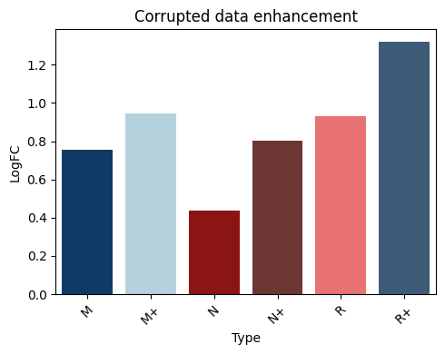
    

