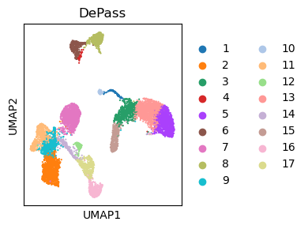
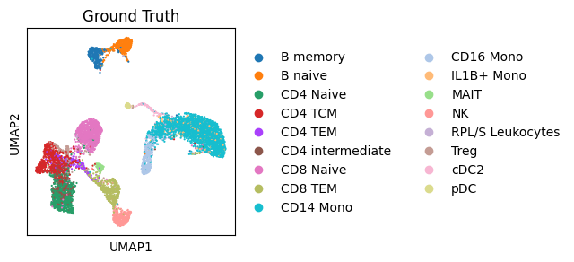

# Tutorial 11: 10x Multiome (PBMC 10k)

DePass was applied to the PBMC 10k dataset (8,105 cells) for cross-modal integration. This tutorial demonstrates clustering and dimensionality reduction (UMAP) visualization. 

### Preparation


```python
import scanpy as sc
import torch
import random
import pandas as pd
import numpy as np
import os
import warnings

warnings.filterwarnings("ignore")

from DePass.utils import *
fix_seed(2024)  

# Environment configuration
device = torch.device('cuda:0' if torch.cuda.is_available() else 'cpu')

os.environ['R_HOME'] = '/home/jyx/anaconda3/envs/r-431/lib/R'

path = '../data/dataset_PBMC10k'
os.mkdir(path) if not os.path.exists(path) else print(f"The directory '{path}' already exists.\n")
```

### Loading and Preprocessing


```python
adata_omics1 = sc.read_h5ad('../data/dataset_PBMC10k/adata_RNA.h5ad')
adata_omics2 = sc.read_h5ad('../data/dataset_PBMC10k/adata_ATAC.h5ad')

preprocess_data(adata=adata_omics1,modality='rna')
preprocess_data(adata=adata_omics2,modality='atac')

adata_omics1.obsm['input_feat'] = adata_omics1.obsm['X_norm'].copy()
adata_omics2.obsm['input_feat'] = adata_omics2.obsm['X_lsi'].copy()
data = {'rna': adata_omics1, 'atac': adata_omics2}
```

### Training the model


```python
from DePass.model import DePass
model = DePass(data, data_type='single_cell',device=device)
output = model.train()
```

    [Config]
    Modalities: 2 | Data: single_cell | Device: NVIDIA GeForce RTX 4090 
    
    [Initializing]
    Graph Construction : Running...
    Graph Construction : Done!
    Data Enhancement : Running...
    Data Enhancement : Done!


    Computing METIS partitioning...
    Done!


    
    
    [Training]
    Model training starts...


    100%|██████████| 200/200 [00:08<00:00, 24.78it/s]


    Model training finished!
    


```python
adata = adata_omics1.copy()
adata.obsm['DePass'] = model.embedding
```

### Clustering


```python
from DePass.utils import *
clustering(adata=adata,n_clusters=17,key='DePass',add_key='DePass',method='mclust',use_pca=True)
```

    R[write to console]:                    __           __ 
       ____ ___  _____/ /_  _______/ /_
      / __ `__ \/ ___/ / / / / ___/ __/
     / / / / / / /__/ / /_/ (__  ) /_  
    /_/ /_/ /_/\___/_/\__,_/____/\__/   version 6.1.1
    Type 'citation("mclust")' for citing this R package in publications.
    


    fitting ...
      |======================================================================| 100%


```python
from DePass.utils import super_eval
import pandas as pd
re = super_eval(adata.obs['DePass'],adata.obs['Y'])
pd.DataFrame(list(re.items()), columns=['metric', 'Value']).to_csv(path + '/re.csv', sep='\t', index=True, float_format='%.6f')
print(re)
```

    {'AMI': 0.7318717379655737, 'NMI': 0.7336733748430829, 'ARI': 0.5298944194207265, 'Homogeneity': 0.7695730222733254, 'V-measure': 0.7336733748430828, 'Mutual Information': 1.7881842958672314}


```python
import matplotlib.pyplot as plt

fig, ax = plt.subplots(figsize=(4, 3))  
sc.pp.neighbors(adata, use_rep='DePass', n_neighbors=30)
sc.tl.umap(adata)
sc.pl.umap(adata, color='DePass', title='DePass', ax=ax, s=10, show=False)

plt.tight_layout()
plt.savefig(path +  '/DePass.pdf', bbox_inches='tight', dpi=300)
plt.show()
```


    

    


```python
import matplotlib.pyplot as plt

fig, ax = plt.subplots(figsize=(3, 3))  

sc.pl.umap(adata, color='celltype', title='Ground Truth', ax=ax, s=10, show=False)
plt.tight_layout()
plt.savefig(path +  '/Ground Truth.pdf', bbox_inches='tight', dpi=300)
plt.show()
```


    

    


```python
adata.write_h5ad(path + '/adata.h5ad')  
```


